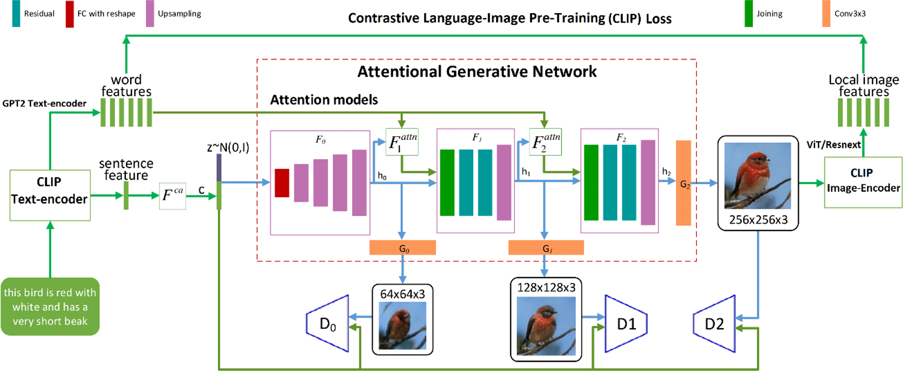

# AttnGAN + CLIP (Python 3, Pytorch 1.0)
Model modify


full project in : https://drive.google.com/drive/folders/1NwNOofAvyBEN6VtaNJ4N_-qX2vd-0Ugg?usp=sharing
### Dependencies
python 3.6+

Pytorch 1.0+

In addition, please add the project folder to PYTHONPATH and `pip install` the following packages:
- `python-dateutil`
- `easydict`
- `pandas`
- `torchfile`
- `nltk`
- `scikit-image`


**Data**

1. Download our preprocessed metadata for [birds](https://drive.google.com/open?id=1O_LtUP9sch09QH3s_EBAgLEctBQ5JBSJ) [coco](https://drive.google.com/open?id=1rSnbIGNDGZeHlsUlLdahj0RJ9oo6lgH9) and save them to `data/`
2. Download the [birds](http://www.vision.caltech.edu/visipedia/CUB-200-2011.html) image data. Extract them to `data/birds/`
3. Download [coco](http://cocodataset.org/#download) dataset and extract the images to `data/coco/`


**Training and validate**
- Using note book: AttnGAN-Project3.ipynb

### Citing AttnGAN
If you find AttnGAN useful in your research, please consider citing:

```
@article{Tao18attngan,
  author    = {Tao Xu, Pengchuan Zhang, Qiuyuan Huang, Han Zhang, Zhe Gan, Xiaolei Huang, Xiaodong He},
  title     = {AttnGAN: Fine-Grained Text to Image Generation with Attentional Generative Adversarial Networks},
  Year = {2018},
  booktitle = {{CVPR}}
}
```

**Reference**

- [StackGAN++: Realistic Image Synthesis with Stacked Generative Adversarial Networks](https://arxiv.org/abs/1710.10916) [[code]](https://github.com/hanzhanggit/StackGAN-v2)
- [Unsupervised Representation Learning with Deep Convolutional Generative Adversarial Networks](https://arxiv.org/abs/1511.06434) [[code]](https://github.com/carpedm20/DCGAN-tensorflow)
